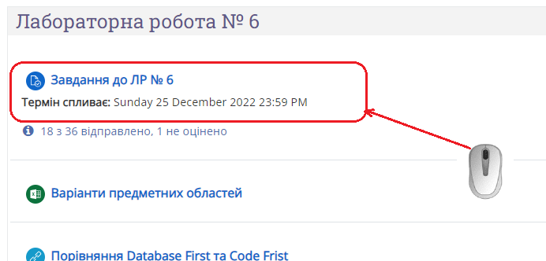
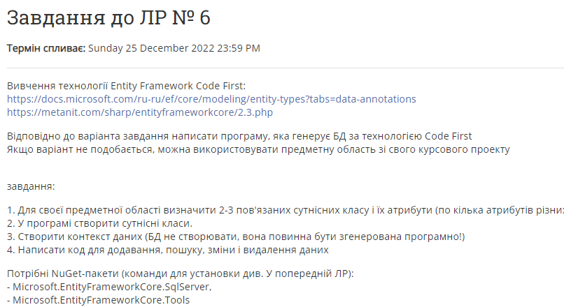
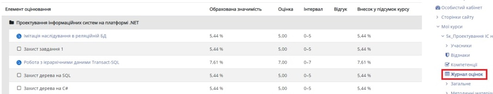
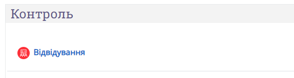
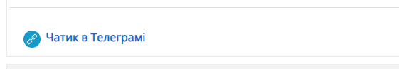

# Frequently Asked Questions

:question:
_Де знайти завдання?_

Курс поділений на теми. В більшості тем є елемент завдання.

Розкривши його можна побачити формулювання завдання:

---

:question:
_Для завдання встановлений дедлайн. Якщо не вклався, то вже і не здавати?_

Ні, все одно здавати. За прострочку будуть знижені бали.

---

:question:
_А ви вже перевірили мою роботу?_

:question:
_А які в мене оцінки?_

:question:
_Як узнати, чи здав я третю лабораторну?_

Дійсно, де же це узнати? Може в Журналі оцінок?

---

:question:
_Як отримати 60 балів? А 90? А 100?_

Здавати завдання. Більшість завдань передбачають завантаження звіту і
захист завдання на відеосеансі. Скількі балів за це дається -- можна
узнати в Журналі оцінок (див. вище). Якщо для завдання встановлені
дедлайни, оцінка може бути знижена, навіть якщо завдання виконано повно
і якісно. За відвідування також начисляються бали (обично, до 5).

---

:question:
_Як захищати завдання?_

Студент в режимі демонстрації екрану презентує свою роботу, коментує
програмний код та демонструє роботоспроможність програми, а також
володіння кодом та його розуміння. Викладач задає питання та дає
додаткові завдання (як правило, невеличкі модифікації існуючого коду).

---

:question:
_А можна не захищати завдання?_

Можна. Але тоді ви значно втрачаєте в балах (скільки саме -- дивись у
Журналі оцінок).

---

:question:
_Я тут случайно виконав чужий варіант. Це ж нічого?_

Варіанти хоч і схожі, та все ж індивідуальні. Якщо ви дійсно самі його
виконали, вам на складно буде переробити завдання на свій варіант.

_Примітка:_ в деяких курсах завдання без варіантів.

---

:question:
_А перекличка вже була?_

В більшості випадків студенти самі реєструються на занятті за допомогою
елемента Відвідування.

---

:question:
_А можна не відвідувати заняття? Це ж все одно дистанціонка._

Дистанційне навчання є різновидом очного, тільки здійснюється за
допомогою телекомунікаційних технологій. Отже, відвідування занять є
обов'язковим, фіксується в журналі Відвідування і впливає на підсумкову
оцінку. Звичайно, якщо через повітряну тривогу або блекаут ви змушені
покинути заняття -- таке життя. Це пояснює, але не виправдовує пропуски.

---

:question:
_Ви ж виложите запис лекції?_

Обов'язково. 

---

:question:
_Тоді можна не присутствовати? Потім самі відосик подивимось_

Може ви ще й книжку самі почитаєте? Жоден викладач у це давно не вірить.
Якщо серйозно: перевага сінхронних занять у можливості обговорювати 
будь-які питання та швидко виправляти помилки. 
Основний недолік самоосвіти - люди скоріше поглиблюють власні помилки,
ніж виправляють їх. 
Та і графіку за розкладом дотримуватись легше.
Самоосвіта - це добре, але потребує набагато більше зусиль, ніж
заняття з викладачем, навіть через монітор.

---

:question:
_А якщо у мене вдень ніколи не буває світла, я ж можу вчитися асинхронно?_

Асинхронний режим доповнює синхронні заняття, але не є основним.
Звичайно, ви можете виконувати завдання і загружати їх на Ментор в
асинхронному режимі. Але, якщо розраховуєте на високу оцінку -- треба
знаходити можливості підключатись на відеосеанси для захисту завдань.

---

:question:
_А якщо дійсно немає світла?_

Якщо необхідно, можна погодити додаткові відеосеанси у позанавчальний
час.

---

:question:
_А якщо зовсім немає світла? Ви що, не чули про блекаути?_

Нажаль, не тільки чула, але й бачила. Але це не змінить строків семестра
та сесії. Завдання все одно треба виконувати. І дедлайни встановлені не
просто так.

---

:question:
_А якщо я хворів весь семестр і в мене є довідка?_

Нажаль, я не зможу оцінити в балах медичну довідку. Якщо ситуація зі
здоров'ям справді серйозна -- зверніться в деканат з приводу продовження
сесії (якщо хворіли саме в сесію) або академічної відпустки. Якщо ж
вирішили продовжувати навчання -- доведеться виконувати завдання.

---

:question:
_А якщо в мене посеред ночі виникнуть запитання з лабораторної роботи я
можу вам написати?_

Так, ви можете писати у будь який час, я вмію виключати звук на телефоні. 
Контакти викладача можна знайти в Менторі. 
Також там є посилання на чат-групу для обговорення оперативної
інформації (світло вимкнули і т.ін.). Але на швидку відповідь ви можете
розраховувати тільки під час заняття. Іншими словами: ви пишете, коли
удобно вам, я відповідаю, коли удобно мені.

---

:question:
_Ваші завдання нецікаві. Можна я щось своє буду робити?_

:question:
_У мене є класний проект. Можна я буду працювати над ним замість лаб?_

:question:
_Я щось подібно проходив у іншому вузі / на курсах / у курсовому проекті, може ви зарахуєте?_

Ні. Я не зможу оцінити тих завдань, які я не видавала, а класні проекти
рідко бувають закінчені. Інша справа, якщо у вас вже є свій код з проекту,
подібний до тематики завдань. Тоді ви можете використовувати його для
захисту завдання. Але такі питання краще уточнювати.

---

:question:
_А можна використовувати іншу СУБД / бібліотеку / середовище розробки і
т.д._

Якщо ви можете виконати поставлені завдання з допомогою інших
інструментів -- так. Але це не должно призводити до надто «творчої»
інтерпретації завдання. Загалом, це теж краще уточнювати.

---

:question:
_Що я тут роблю?_

Ну...
